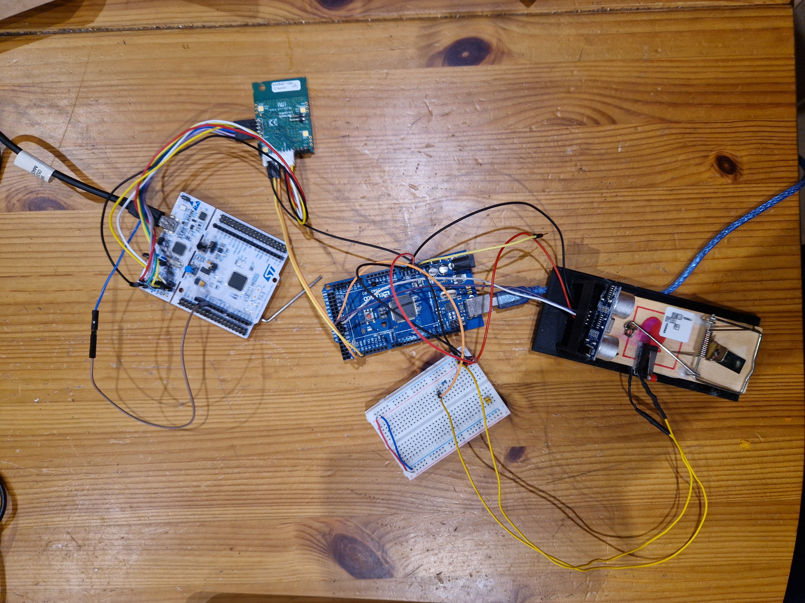
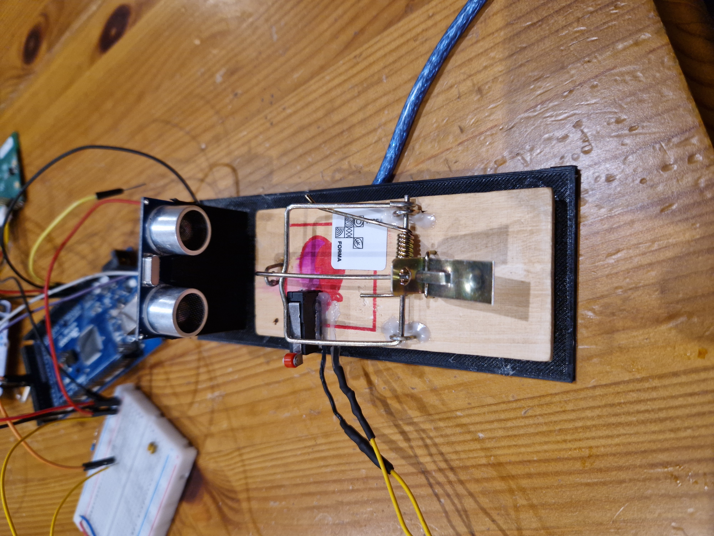
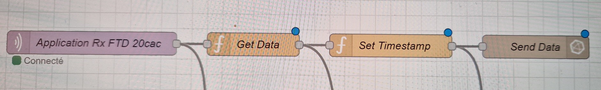
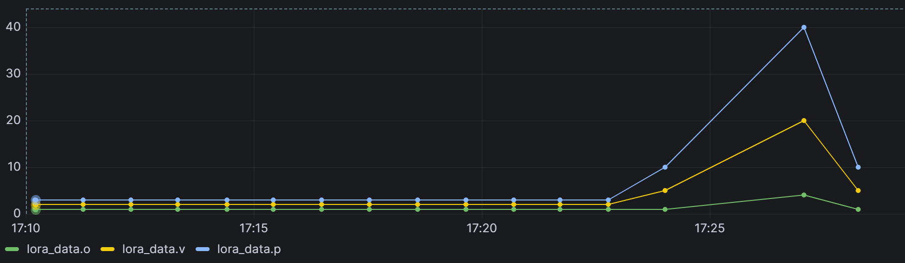

Pour executer le code:
S'assurer de mettre `main.c` dans un repertoire contenant `boards` et `modules`, puis:
`$ make -j 4 flash`

# Projet IoT | Tapette à souris connectée

## Description du projet
Ce projet vise à développer une tapette à souris connectée utilisant une carte STM32L151CC et la communication LoRa pour surveiller et rapporter les activités des souris. Les données collectées sont transmises via Node-RED et affichées sur Grafana pour une analyse visuelle.

## Domaine d'utilisation
Ce projet peut être utilisé dans les environnements domestiques, les entrepôts, ou tout autre espace où la présence de souris doit être surveillée à distance pour des raisons de santé et de sécurité. Ce projet permet également de connaitre l'état du piège sans avoir à vérifier visuellement le piège.

## Concurrence du marché
La tapette à souris connectée se distingue par sa capacité à fournir des données en temps réel sur l'activité des souris, une fonctionnalité absente des tapettes à souris traditionnelles. Peu de dispositifs sur le marché offrent une intégration aussi transparente avec des plateformes comme Node-RED et Grafana.

## Équipements
- STM32L151CC microcontrôleur avec module de communication LoRa
- Capteur de distance ultrasonique version HC-SR04
- Bouton poussoir
- Plateforme Node-RED pour le traitement des données
- Grafana pour l'affichage des données

## Assemblement du système

Sur la figure suivante, nous pouvons voir le montage réalisé:



Sur la partie gauche de l'image, nous avons la STM32 reliée par ST-Link à la carte Wyres-base. Il ya également une liaison UART pour pouvoir afficher des formations sur le terminal et permettre le débogage. La carte Wyres-base est également connectée (Work in Progress) à la carte arduino. La carte arduino gère les données recues par le capteur ultra-son  et le bouton poussoir.
Le bouton poussoir permet de détecter lorsque le piège est armé. Le bouton est situé sous la partie mobile de la tapette à souris (voir figure suivante) lorsque cette dernière est armée. Le piège à ultra-son détecte s'il y a eu du mouvement à proximité. Pour cela, nous effectuons plusieurs mesures à intervalle de temps régulier et réalisons une moyenne glissante sur ces données. Pour détecter du mouvement, il faut obtenir une variation de distance suffisament grande (valeur arbitraire).

Une fois les données traitées, la carte arduino va envoyée deux flag à la carte Wyres-base:
- Un flag responsable de l'état du piège (armé ou non),
- Un flag à 1 si du mouvement a été détecté.



## Format de données (payload)
Le format des données envoyées via LoRaWAN est le suivant :
- `o` : État du piège (1 pour armé, 0 pour désarmé)
- `v` : Détection de mouvement (1 pour détecté, 0 pour non détecté)
- `p` : Valeur à ajouter

Exemple de payload : `o=001 ,v=001 ,p=050`

## Métriques logicielles
Le logiciel envoie les données en lora toute les minutes (duty cycle restriction). Au lancement du logiciel, les données peuvent ne pas être transmises, du fait du duty cycle restriction, après quelques cycles, les données sont envoyées toutes les minutes.

En ce qui concerne les mesures des données, un capteur est un bouton poussoir, passant ou bloquant, les erreurs de mesures sont donc inexistantes.
Pour le second capteur, nous effectuons une moyenne glissante pour détecter du mouvement. Si cette moyenne varie fortement (valeurs de mesures du catpeur ultra-son fortement décroissantes), le flag associé à la detection de mouvement, va être bloqué à 1 pendant une minute, pour être sûr que la présence de mouvement est prise en compte par la carte Wyres-base.

## Fiche ACV - Tapette à souris connectée

### Fabrication et Approvisionnement des Composants
- **STM32L151CC** : Fabrication impliquant des processus complexes et une chaîne d'approvisionnement mondiale.
- **Carte Wyres-base et Arduino** : Nécessitent des matériaux tels que le cuivre, le plastique et les semi-conducteurs.
- **Capteur Ultrason HC-SR04** : Composé de circuits imprimés, de transducteurs et de boîtiers en plastique.
- **Bouton Poussoir** : Fabriqué principalement en plastique et en métal.
- **Modules LoRa** : Impliquent des composants électroniques et des antennes.
- **Impact** : Extraction de matières premières, consommation d'énergie lors de la fabrication, transport.

### Consommation d'Énergie
- **En Fonctionnement** : Faible consommation d'énergie grâce à l'utilisation d'un microcontrôleur basse consommation (STM32L151CC).
- **Transmission de Données** : Optimisée par la technologie LoRa, qui est conçue pour la communication longue portée à faible consommation d'énergie.
- **Impact** : Réduction de l'empreinte carbone grâce à des technologies énergétiquement efficaces.

### Utilisation
- **Durée de Vie Prévue** : La conception modulaire permet de remplacer uniquement la tapette, prolongeant ainsi la durée de vie du système global.
- **Maintenance** : Réduction des déchets électroniques par la maintenance partielle du dispositif.
- **Impact** : Minimisation des déchets électroniques, réduction de la nécessité de production de nouveaux appareils.

### Fin de Vie
- **Recyclage** : Les composants électroniques peuvent être recyclés, bien que cela nécessite des installations spécialisées. Le bois de la tepette à souris peut également être facilement recyclé. Le support du système peut également être recyclé en bobine PLA.
- **Déchets** : La tapette en bois peut être remplacée sans jeter le système électronique, réduisant les déchets.
- **Impact** : Moins de déchets électroniques et une meilleure gestion des ressources.

### Transport
- **Distribution** : Transport des composants depuis les lieux de fabrication jusqu'à l'utilisateur final.
- **Maintenance** : Réduction des transports nécessaires grâce à la modularité.
- **Impact** : Empreinte carbone liée au transport réduit par des pratiques de maintenance efficaces.

### Points d'Amélioration
- **Choix des Matériaux** : Utiliser des matériaux plus écologiques pour les composants.
- **Optimisation Énergétique** : Améliorer encore l'efficacité énergétique des composants électroniques.
- **Fin de Vie** : Faciliter le démontage et le recyclage des composants.


## Fiche Security & Privacy

### Mesures de Sécurité
- **Protocoles Sécurisés** : Utilisation de protocoles de communication sécurisés pour garantir la confidentialité et l'intégrité des données transmises via LoRa.
- **Authentification** : Implémentation de mécanismes d'authentification pour s'assurer que seuls les dispositifs autorisés peuvent accéder au réseau.

### Protection des Données
- **Minimisation des Données** : Réduction de la collecte des données à ce qui est strictement nécessaire pour le fonctionnement du système, respectant ainsi le principe de minimisation des données.


## Code source du microcontrôleur
Le code source pour la STM32L151CC peut être trouvé dans le répertoire `src`. Ce code source est décomposé en 3 parties:
Une première partie va permettre la configuration de la communication lora:

```c
int lora_init(void){
	puts("Start init lora\n");
	/* Convert identifiers and application key */
	fmt_hex_bytes(deveui, DEVEUI);
	fmt_hex_bytes(appeui, APPEUI);
	fmt_hex_bytes(appkey, APPKEY);

	/* set the LoRaWAN keys */
	semtech_loramac_set_deveui(&loramac, deveui);
	semtech_loramac_set_appeui(&loramac, appeui);
	semtech_loramac_set_appkey(&loramac, appkey);
	semtech_loramac_set_adr(&loramac, true);
	semtech_loramac_set_dr(&loramac, 0);
	
	switch (semtech_loramac_join(&loramac, LORAMAC_JOIN_OTAA)) {
            case SEMTECH_LORAMAC_DUTYCYCLE_RESTRICTED:
                puts("Cannot join: dutycycle restriction\n");
                return 1;
            case SEMTECH_LORAMAC_BUSY:
                puts("Cannot join: mac is busy\n");
                return 1;
            case SEMTECH_LORAMAC_JOIN_FAILED:
                puts("Join procedure failed!\n");
                return 1;
            case SEMTECH_LORAMAC_ALREADY_JOINED:
                puts("Warning: already joined!\n");
                return 1;
            case SEMTECH_LORAMAC_JOIN_SUCCEEDED:
                puts("Join procedure succeeded!\n");
                break;
            default: /* should not happen */
                puts("Critical Lora Init\n");
                break;
        }
        semtech_loramac_set_tx_mode(&loramac, LORAMAC_TX_UNCNF);
        semtech_loramac_set_tx_port(&loramac, 2);
        return 0;
}

```

La seconde partie du programme permet de récupérer les données envoyé à partir d'une carte arduino. Malheureusement, nous n'avons pas réussis cet envoie de données (SPI, I2C essayés). Actuellement des données sont générées pour tester la communication lora.

La dernière partie du code source permet d'envoyer les données en lora:

```c
while (1){

    /**** Build Payload ****/
    sprintf(payload,"o=%03d ,v=%03d ,p=%03d",(int)data1, data2, data3);
			
	/**** Send payload via LoRaWAN ****/
	switch (semtech_loramac_send(&loramac,  (uint8_t *)payload, strlen(payload))) {
	    case SEMTECH_LORAMAC_NOT_JOINED:
		    puts("Cannot send: not joined\n");
		    break;
		case SEMTECH_LORAMAC_DUTYCYCLE_RESTRICTED:
		    puts("Cannot send: dutycycle restriction\n");
		    break;
	    case SEMTECH_LORAMAC_BUSY:
		    puts("Cannot send: MAC is busy\n");
		    break;

	    case SEMTECH_LORAMAC_TX_ERROR:
		    puts("Cannot send: error\n");
		    break;

	    case SEMTECH_LORAMAC_TX_CNF_FAILED:
		    puts("Fail to send: no ACK received\n");
            break;
			}
    xtimer_sleep(duration);
    puts("Looping...\n");
}
```

## Gestion des données avec Node-Red

Une fois les données récupérées, elles sont envoyées en lora et récupérée via Node-Red où elles sont traitées. Les nodes Node-Red sont affichées sur la figure suivante:



La receptions des données se fait avec `Application Rx FTD 20cac`, les données sont ensuite convertie en un seul objet JSON `{'o :' x, 'v :' y, 'p :' z}` avec la node `Get Data`. On rajoute un timestamp pour que les données sont utilisables par Graphana avec la node `Set Timestamp`. Enfin, les données sont envoyées à Grafana avec `Send Data`.

## Affichage des données avec Grafana

La dernière étape est d'afficher les données sur Grafana.
Pour cela nous créons un DashBoard avec la requête SQL suivante:
`SELECT "o", "v", "p" FROM "lora_data" WHERE $timeFilter`.

En générant les données, nous obtenons le graphique suivant:



Cela permet de vérifier la bonne communication des données entre la carte Wyres-base, l'antenne Lora, Node-Red et Grafana.
